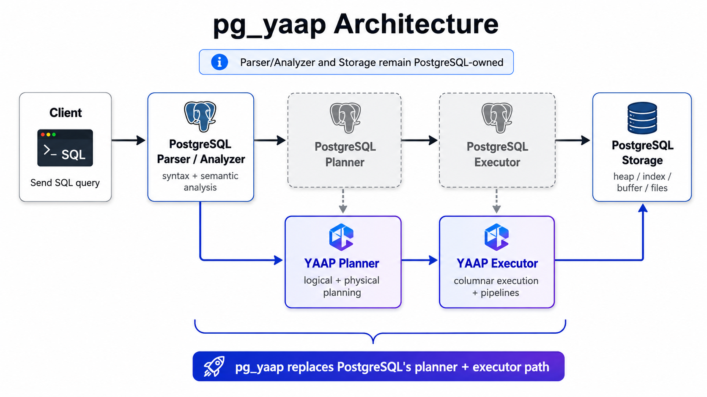
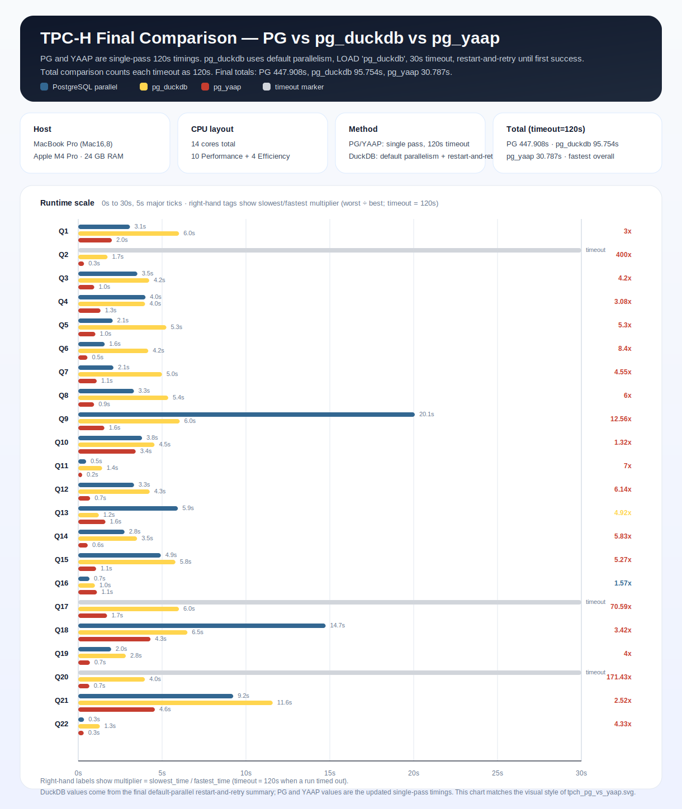

# pg_yaap — Yet Another Analytic Processing ⚡

<p align="center">
  
</p>

<p align="center">
  <strong>Modern OLAP inside PostgreSQL: a YAAP-owned optimizer plus a C++ columnar execution engine.</strong>
</p>

<p align="center">
  <a href="README.zh.md">🇨🇳 中文</a>
  ·
  <a href="LICENSE">📄 License</a>
  ·
  <a href="#quick-start-">🚀 Quick Start</a>
  ·
  <a href="#architecture-">🏗️ Architecture</a>
  ·
  <a href="#tpc-h-snapshot-">📊 Benchmark</a>
</p>


---

## What is pg_yaap? 🚀

`pg_yaap` is a PostgreSQL extension that replaces PostgreSQL's planner and executor path for supported analytical queries with a YAAP-owned optimizer and a C++ columnar execution engine.

The key point: **YAAP does not replace PostgreSQL itself.**

PostgreSQL still owns the boring-but-critical database stuff:

* 🧾 SQL parsing
* 🗂️ catalog access
* 💾 storage
* 🔒 transactions
* 🌐 protocol and result delivery
* 🧩 the rest of the server runtime

YAAP takes over the analytical hot path:

* 🧠 logical planning
* 🛠️ physical planning
* 📦 vectorized / columnar execution
* 🧵 parallel pipeline execution

In short: PostgreSQL remains the system of record. YAAP gives selected OLAP queries a much more modern execution path.

---

## Why pg_yaap? ⚡

PostgreSQL is great as a general-purpose database, but analytical workloads often want a very different execution model from the classic tuple-at-a-time executor.

`pg_yaap` explores that direction without turning PostgreSQL into a fork:

* 🐘 keep PostgreSQL parser, catalog, storage, and transaction semantics
* 🧠 use a YAAP-owned optimizer for supported analytical queries
* 📦 process data in columnar batches instead of one tuple at a time
* 🏗️ organize execution around pipelines and explicit pipeline breakers
* 🔥 fail loudly after YAAP claims a query instead of silently falling back

No magic. No hidden fallback. If YAAP owns the query, YAAP owns the result.

---

## Core ideas 🧠

* **YAAP-owned optimizer**
  Supported analytical queries are routed into YAAP's logical and physical planners.

* **Columnar execution engine**
  Runtime execution is based on batches instead of PostgreSQL's traditional per-tuple executor model.

* **Pipeline-based execution**
  Operators are organized into execution pipelines, with joins, aggregation, and sort treated as explicit pipeline breakers.

* **PostgreSQL-native integration**
  YAAP enters through PostgreSQL hooks and returns results through PostgreSQL's normal tuple interfaces.

* **No silent fallback**
  Once YAAP admits a query, it should either run it or fail clearly. This keeps development and benchmarking honest.

---

## Architecture 🏗️



At a high level:

1. `planner_hook` routes supported queries into YAAP's logical and physical planners.
2. `ExecutorStart` and `ExecutorRun` hand admitted queries to YAAP's runtime.
3. YAAP executes columnar batches through parallel pipelines.
4. Results are converted back to PostgreSQL's normal tuple interface.

---

## TPC-H snapshot 📊



> Benchmark numbers depend on hardware, PostgreSQL configuration, dataset scale factor, query coverage, and whether the query is fully supported by YAAP. Treat this chart as a snapshot, not a universal claim.

---

## Build 🔧

### Meson

```bash
meson setup build -Dpg_config=/path/to/pg_config
meson compile -C build
meson install -C build
```

### PGXS / Makefile

```bash
make PG_CONFIG=/path/to/pg_config
make PG_CONFIG=/path/to/pg_config install
```

---

## Quick start 🧪

```sql
LOAD 'pg_yaap';
SET pg_yaap.enabled = on;
SET pg_yaap.parallel = on;
```

Then run supported analytical SQL queries as usual.

```sql
SELECT
    l_returnflag,
    l_linestatus,
    sum(l_quantity) AS sum_qty,
    sum(l_extendedprice) AS sum_base_price
FROM lineitem
GROUP BY l_returnflag, l_linestatus
ORDER BY l_returnflag, l_linestatus;
```

---

## Current scope 🚧

`pg_yaap` is focused on analytical query processing. It is not trying to replace PostgreSQL as a database system.

Good fit:

* ✅ scan-heavy OLAP queries
* ✅ TPC-H-style analytical workloads
* ✅ modern optimizer / executor experiments inside PostgreSQL
* ✅ columnar and vectorized execution research
* ✅ pipeline and parallel execution research

Not the goal:

* ❌ replacing PostgreSQL storage
* ❌ replacing PostgreSQL parser or catalog
* ❌ becoming a general-purpose PostgreSQL fork
* ❌ silently masking unsupported behavior with fallback execution
* ❌ general OLTP acceleration

---

## Acknowledgements 🙏

Thanks to the PostgreSQL project for its hook architecture, extension ecosystem, and decades of database engineering.

Thanks to DuckDB for inspiring many modern ideas around optimizer structure, vectorized execution, and columnar analytical processing.

---

## 中文版 🇨🇳

For the Chinese version, see [README.zh.md](README.zh.md).

---

## License 📄

Apache License 2.0 — see [LICENSE](LICENSE).

